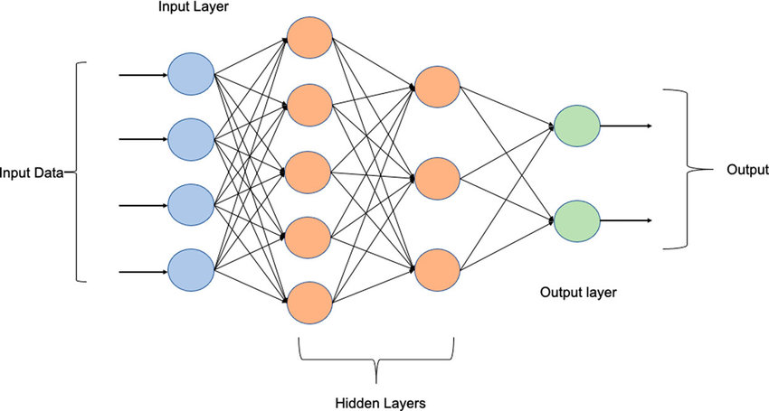

## Micrograd
---

#### What is a Micrograd?
It is a very basic implementation of autograd engine.

#### What is a Autograd?
An Autograd engine in simple terms is used to calculate the gradient of a function. This gradient is an important mathematical tool which is used very much in training Machine Learning and Deep Learning models. Even though its a very simple idea of gradient it is the core concept behind the training of ML and DL models and that makes an Autograd engine important.

#### Things I Learnt
- what autograd are?
- how the autograd engines work?
- how to build a MLP(Multi Layer Perceptron)?

**PS: A thanks to Karpathy Sensei for teaching it in such an intuitive way.**
